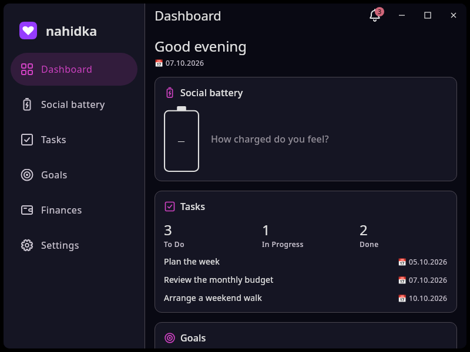

# Integrated desktop title bar

The desktop header places the current page title, notifications, and window controls in one 40 dp row beside the sidebar, without a bottom separator. The sidebar starts at the top of the window. Page content follows the header with its normal 16 or 24 dp padding; the separate 64 dp application header is removed on desktop.

Finances appears before Settings in the sidebar and mobile navigation and opens the existing financial history and planning page. The phone navigation uses compact labels and spacing to keep all six buttons accessible.

The shared `App` accepts an `ApplicationTopBarRenderer`, with its standard header as the default. Desktop supplies `NahidkaTitleBar`, which reuses `ApplicationTopBar` for the title and back action and receives the existing notification action from the shell. `WindowControlButton` handles each desktop control's rendering and interaction. Native window implementations share the caption hit test in `ChromeGeometry`, so notification and back buttons remain outside the drag region. Native macOS controls retain space above the sidebar's scrollable content.



[Light theme](linux-light.png) · [Compact desktop layout](linux-compact.png)

[Desktop finances](linux-finances.png) · [320 dp phone finances](phone-finances-320.png) · [390 dp phone finances](phone-finances-390.png)

## Validation on 7 October 2026

The final development distributable, all nine shared JVM tests, and the Web JS/Wasm and Android entry points passed this command using JetBrains Runtime 25:

```sh
./gradlew :desktopApp:createDistributable :shared:jvmTest \
  :webApp:compileKotlinJs :webApp:compileKotlinWasmJs \
  :androidApp:compileDebugKotlin --offline --console=plain
```

The shared UI regressions check the 40 dp header, content position, notification navigation, and page title updates. They also open Finances from the sidebar and mobile navigation, exercise history, planning, and the operation dialog, and return from notifications to Finances. Both 320 and 390 dp phone layouts keep all six buttons visible with at least 48 dp touch targets and complete labels.

The built launcher was exercised with XTest pointer input in isolated Xephyr/KWin X11 sessions at 100% scale. [Dark-theme checks](linux-dark-checks.json) cover the layout, notification popup, title updates, caption dragging and double click, maximize/restore, edge resizing, minimize, compact layout, close, and startup frame callbacks. [Light-theme checks](linux-light-checks.json) cover the rendered layout, colors, close, and startup frame callbacks. Screenshots were visually inspected against the supplied drawing. The application used isolated settings storage.

The subsequent [Finances checks](linux-finance-checks.json) verify the sidebar entry and selection and the absence of the title-bar separator in floating, maximized, and compact windows. The [updated light-theme checks](linux-separator-light-checks.json) also verify that the separator is absent.

Windows and macOS runtime behavior was not exercised on this Linux host.
